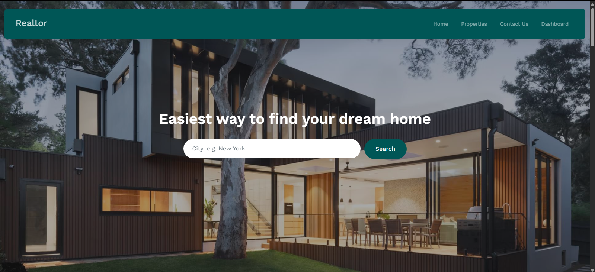

# 🏡 Realtor — Real Estate Listing Platform

Realtor is a full-featured real estate web platform built with **Laravel**, **Blade**, and **Tailwind CSS**. It enables home seekers to find properties easily, agents to manage property listings efficiently, and administrators to maintain the platform securely and professionally.

---

## 📸 Homepage Preview



---

## 🧩 Project Overview

**Realtor** serves as a bridge between property seekers and real estate agents. The platform is optimized for performance and clarity, offering an elegant homepage, a powerful property search engine, and dedicated dashboards for administrators and agents.

---

## 👤 User Roles and Features

### 1. 🛡 Admin

Admins have full control over the platform.

**Key Capabilities:**

- Dashboard access
- Manage users (ban/unban agents or users)
- View and delete property listings
- Manage site-wide settings (name, logo, footer, social links)
- Monitor platform analytics
- Create/update homepage content

---

### 2. 🏢 Agent

Agents are verified sellers who can list and manage properties.

**Key Capabilities:**

- Access personalized dashboard
- Add, update, and delete their own properties
- View inquiries submitted via their listings
- Edit profile and change password
- Track listing engagement (views, contacts)

---

### 3. 🌍 Visitor / Registered User

Casual or registered users looking for homes.

**Key Capabilities:**

- Browse homepage and search properties by city
- View detailed property information
- Contact agents via the contact form
- Register/Login for additional features (optional)

---

## 🎯 Core Features

- 🔍 Real-time property search
- 🖼 Elegant property listings with images
- 📫 Contact forms for inquiries
- 🧾 Admin and agent dashboards
- 🚫 User banning system (Admin only)
- ⚙️ Site-wide settings and branding
- 🌐 Responsive design for mobile and desktop

---

## 🛠 Tech Stack

- Laravel 12
- Blade templating engine
- Bootstrap
- MySQL

---

## 🚀 Getting Started

### Prerequisites

- PHP = 8.3
- Laravel Herd
- Laravel installer = 5.3 
- Composer
- MySQL
- Node.js + NPM

### Installation

```bash
git clone https://github.com/Dev-Dymon/Realtor.git
cd realtor

# Install backend dependencies
composer install

# Install frontend dependencies
npm install && npm run dev

# Set up environment
cp .env.example .env
php artisan key:generate

# Run migrations and optional seeders
php artisan migrate --seed

# Serve the app
php artisan serve or http://realtor.test
